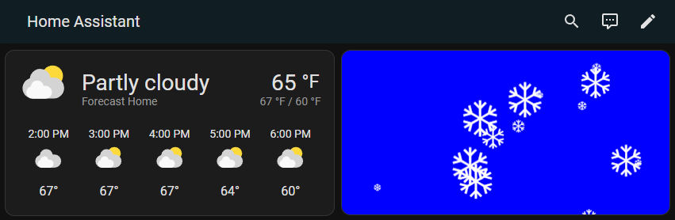

# CheerLights JavaScript Widgets
CheerLights JavaScript Widgets are a collection of embeddable widgets that display the current CheerLights color on web pages. They leverage the CheerLights JavaScript library to fetch the current color and display it. You can find the CheerLights JavaScript library on [GitHub](https://github.com/cheerlights/cheerlights-javascript).

## Solid Color Background
This widget displays the background color set to the latest CheerLights color.

> [Solid Color Background CheerLights Widget](https://widgets.cheerlights.com/solid-color-background.html)

## Snow
This widget displays falling snowflakes using the CheerLights JavaScript library.

> [Snow CheerLights Widget](https://widgets.cheerlights.com/snow.html)

## Logo
This widget displays the CheerLights logo.

> [Logo CheerLights Widget](https://widgets.cheerlights.com/logo.html)

## Embed CheerLights Widgets on a Home Assistant Dashboard

To embed CheerLights widgets on a Home Assistant dashboard, follow these steps:

1. **Open Home Assistant:**
   Open your Home Assistant instance in a web browser.

2. **Navigate to the Dashboard:**
   Go to the dashboard where you want to add the CheerLights widget.

3. **Edit the Dashboard:**
   Click on the three dots menu in the top right corner and select "Edit Dashboard".

4. **Add a New Card:**
   Click on the "Add Card" button to add a new card to your dashboard.

5. **Select the "Webpage" Card:**
   Scroll down and select the "Webpage" card option. This allows you to embed a webpage.

6. **Enter the Widget URL:**
   Enter the URL of the CheerLights widget you want to embed (e.g. https://widgets.cheerlights.com/snow.html).

7. **Save the Card:**
   Click on the "Save" button to save the new card to your dashboard.

